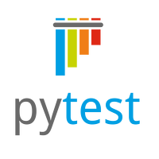

# Пример проекта автотестов для мобильных устройств на примере приложения "Википедия"
> Википедия - общедоступная многоязычная универсальная интернет-энциклопедия со свободным контентом.

### Используемые технологии
<p  align="center">
  <code></code>
  <code></code>
  <code></code>
  <code></code>
  <code></code>
  <code></code>
  <code></code>
  <code></code>
  <code></code>
  <code></code>
</p>

## Покрываемый функционал
- Проверка наличия руководства после установки
- Пропуск руководства 
- Поиск статьи по названию
- Открытие первой найденной статьи


## Запуск тестов
## Для удалённого запуска на BrowserStack необходимо:
1. Быть зарегистрированным на Browserstack
2. В файле .env.credentials указать 
- browserstack_username
- browserstack_accesskey
3. В файле env.bstack указать необходимые параметры для запуска 
4. При запуске в терминале указать команду "context=bstack pytest ."

### Для локального запуска на эмуляторе: 
1. Установить Java SDK, сервер Appium
2. Создать и запустить эмулятор (проверить, что устройство запущено можно командой "adb devices" в командной строке)
3. Запустить сервер appium
4. В файле .env.local_emulator указать необходимые параметры для запуска
5. При запуске в терминале указать команду "context=local_emulator pytest ."

### Для локального запуска на реальном устройстве: 
1. Установить Java SDK, сервер Appium
2. Подключить и настроить реальное устройство к ПК (проверить, что устройство запущено можно командой "adb devices" в командной строке)
3. Запустить сервер appium
4. В файле .env.local_real указать необходимые параметры для запуска
5. При запуске в терминале указать команду "context=local_real pytest ."


### Запуск тестов в [Jenkins](https://jenkins.autotests.cloud/job/qa_guru_graduation_project_mobile/)
Нажмите кнопку «Собрать сейчас»
<p></p>

###  Отчетность о прохождении тестов в Allure
#### Если тест запускался локально:
Введите в терминале команду 
```
allure serve allure-results
``` 
#### Если тест запускался в Jenkins
Нажмите Allure Report или кликните по иконке отчёта в завершённой сборке
<p></p>

### Примеры отображения тестов


#### Так же в отчетах для каждого теста прикрепляется видео

